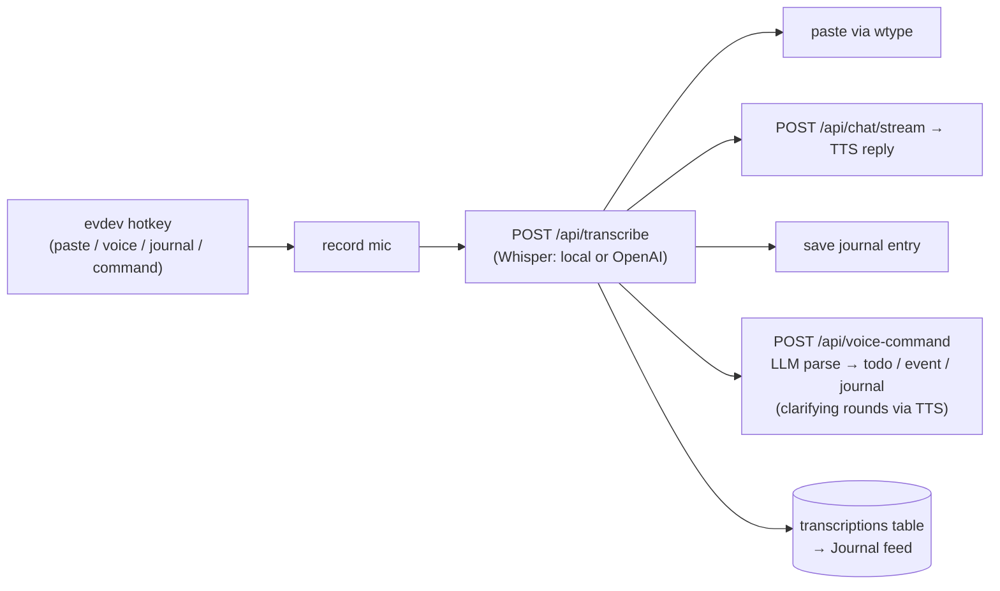

# Lunaschal — Module Structure

High-level structure of the application. See `CLAUDE.md` for per-module details.

```mermaid
flowchart LR
    subgraph SHELL["Desktop / launch"]
        MAIN["main.py<br/>PyWebView window"]
        SCRIPTS["start.sh / start-server.sh<br/>start-node.sh"]
    end

    subgraph FE["Frontend — src/ (React 19 + Vite + Tailwind)"]
        APP["App.tsx<br/>view router + Login"]
        SIDEBAR["Sidebar"]
        SHORTCUTS_FE["src/shortcuts/<br/>keymap + ShortcutProvider"]
        subgraph VIEWS["Views (src/components/)"]
            V_CHAT["Chat / ChatNav"]
            V_TASKS["Tasks"]
            V_JOURNAL["Journal"]
            V_MEET["Meetings"]
            V_WRITE["Writing/"]
            V_CAL["Calendar"]
            V_LEARN["Learning/"]
            V_COOK["Cookbook"]
            V_FIC["Fanfic/ (Library + Reader)"]
            V_NEWS["Newspapers"]
            V_FILES["Editor/ (Files + SttPanel)"]
            V_SET["Settings"]
        end
        API_TS["src/hooks/api.ts<br/>typed REST client"]
        LIB["src/lib/<br/>pure logic (node-env tests)"]
    end

    subgraph BE["Backend — backend/ (Flask, :5000)"]
        APPFACTORY["app.py — create_app()<br/>+ auth middleware"]
        AUTH["auth.py<br/>JWT cookie (network mode)"]
        subgraph ROUTES["Blueprints — backend/routes/"]
            R_CORE["auth · settings · files · shortcuts"]
            R_CHAT["chat (SSE) · rag"]
            R_JOURNAL["journal · calendar · curated_tags · transcriptions"]
            R_LEARN["learning"]
            R_WRITE["writing"]
            R_TASKS["tasks · voice_command"]
            R_COOK["cookbook"]
            R_FIC["fanfic"]
            R_NEWS["newspapers"]
            R_MEET["meetings"]
            R_STT["stt (transcribe / tts)"]
        end
        subgraph AI["AI layer — backend/ai/"]
            PROVIDER["provider.py + llm.py<br/>openai · gemini · ollama"]
            AI_CHAT["chat · classifier · commands"]
            AI_RAG["embeddings · rag"]
            AI_LEARN["learning_generation<br/>learning_grading<br/>learning_verification"]
            AI_MISC["journal · writing<br/>meetings · recipes"]
            MCP["mcp_client.py"]
        end
        subgraph PKGS["Feature packages"]
            P_LEARN["learning/<br/>FSRS scheduler + dedup"]
            P_FIC["fanfic/<br/>xenforo parser · download<br/>epub/docx · sanitize"]
            P_MEET["meetings/<br/>recorder · pipeline · merge"]
            P_NEWS["newspapers/<br/>scraper · sync"]
        end
        DBLAYER["db/ — schema.sql + connection.py<br/>WAL SQLite · FTS5 ×3 · sqlite-vec<br/>_ensure_* migrations"]
    end

    subgraph STORE["./data/"]
        DB[("lunaschal.db")]
        FILES_STORE["fanfic/ · meetings/ · newspapers/<br/>shortcuts.json"]
    end

    subgraph VOICE["OS-level voice — stt/"]
        LISTENER["listener.py<br/>hotkeys · voice chat ·<br/>commands · task nudges"]
        CHECKIN["morning_checkin.py"]
    end

    subgraph EXT["External"]
        LLMS["OpenAI / Gemini / Ollama"]
        WHISPER["Whisper + Kokoro TTS<br/>(local or OpenAI API)"]
        PYANNOTE["pyannote (HF token)"]
        FORUMS["XenForo forums<br/>(SB / SV / QQ)"]
        FRONTPAGES["frontpages.com"]
        MCPSRV["MCP evidence servers"]
        AUDIO["ffmpeg + PipeWire"]
    end

    MAIN --> APPFACTORY
    MAIN -.->|webview| APP
    SCRIPTS --> APPFACTORY

    APP --> SIDEBAR & VIEWS & SHORTCUTS_FE
    VIEWS --> API_TS
    VIEWS -.-> LIB
    API_TS -->|"REST /api + SSE"| APPFACTORY
    APPFACTORY --> AUTH & ROUTES

    R_CHAT --> AI_CHAT & AI_RAG
    R_JOURNAL --> AI_MISC & AI_RAG
    R_LEARN --> AI_LEARN & P_LEARN
    R_WRITE --> AI_MISC
    R_TASKS --> AI_CHAT
    R_COOK --> AI_MISC
    R_FIC --> P_FIC
    R_NEWS --> P_NEWS
    R_MEET --> P_MEET
    P_MEET --> AI_MISC
    AI_LEARN --> MCP --> MCPSRV

    AI_CHAT & AI_RAG & AI_LEARN & AI_MISC --> PROVIDER --> LLMS

    ROUTES --> DBLAYER --> DB
    P_FIC --> FORUMS
    P_FIC & P_MEET & P_NEWS --> FILES_STORE
    P_NEWS --> FRONTPAGES
    P_MEET --> AUDIO
    P_MEET -.-> PYANNOTE
    R_STT --> WHISPER

    LISTENER -->|"transcribe · chat/stream<br/>voice-command · tts"| APPFACTORY
    CHECKIN --> APPFACTORY
```

## Voice pipeline (global hotkeys)

```mermaid
flowchart LR
    KEY["evdev hotkey<br/>(paste / voice / journal / command)"] --> REC["record mic"]
    REC --> TR["POST /api/transcribe<br/>(Whisper: local or OpenAI)"]
    TR --> PASTE["paste via wtype"]
    TR --> CHAT["POST /api/chat/stream → TTS reply"]
    TR --> JRNL["save journal entry"]
    TR --> CMD["POST /api/voice-command<br/>LLM parse → todo / event / journal<br/>(clarifying rounds via TTS)"]
    TR --> LOG[("transcriptions table<br/>→ Journal feed")]
```
